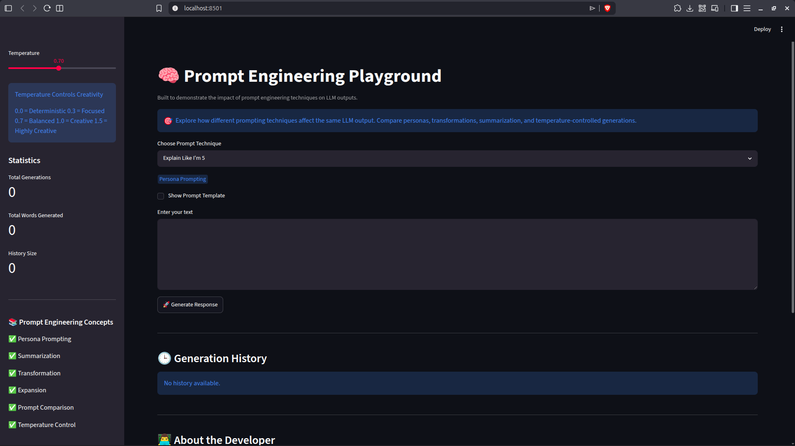

# 🧠 Prompt Engineering Playground

An interactive Streamlit application that demonstrates how different prompt engineering techniques influence the responses generated by Google's Gemini LLM.

This project was built as part of Week 2 of the Gen AI Bootcamp, with a focus on understanding and experimenting with prompt engineering concepts rather than building a generic chatbot.

---

## 🚀 Overview

Large Language Models can produce dramatically different outputs depending on how prompts are designed.

This application allows users to experiment with multiple prompting techniques and compare how the same input is interpreted under different instructions, personas, and generation settings.

The goal is to demonstrate:

* Persona Prompting
* Summarization
* Transformation
* Expansion
* Prompt Comparison
* Temperature Experimentation

---

## ✨ Features

### Explain Like I'm 5 (ELI5)

Explains complex topics using simple language, analogies, and child-friendly examples.

### Teacher Mode

Provides structured educational explanations with:

* Definitions
* Key Concepts
* Examples
* Revision Notes

### Mentor Mode

Provides practical, career-focused guidance including:

* Industry Applications
* Learning Roadmaps
* Common Mistakes
* Actionable Advice

### Professional Rewrite

Transforms informal text into professional communication.

### Summarizer

Converts lengthy text into concise, high-value summaries.

### Grammar Correction

Identifies and corrects grammatical and stylistic issues.

### Format Converter

Transforms unstructured information into clean Markdown tables.

### Interview Question Generator

Creates interview questions with:

* Model Answers
* Evaluation Criteria
* Follow-Up Questions

### Compare Prompt Styles

Compares responses from:

* ELI5 Prompt
* Teacher Prompt
* Mentor Prompt

Using the same input topic.

### Temperature Experimentation

Demonstrates how changing the temperature parameter affects LLM creativity and output style.

---

## 🧪 Prompt Engineering Concepts Demonstrated

| Concept             | Implementation                                             |
| ------------------- | ---------------------------------------------------------- |
| Persona Prompting   | ELI5, Teacher Mode, Mentor Mode                            |
| Transformation      | Professional Rewrite, Grammar Correction, Format Converter |
| Summarization       | Summarizer                                                 |
| Expansion           | Interview Question Generator                               |
| Prompt Comparison   | Compare Prompt Styles                                      |
| Temperature Control | Temperature Experimentation                                |

---

## 🛠 Tech Stack

* Python
* Streamlit
* Google Gemini API
* Prompt Engineering Techniques

---

## 📸 Screenshots

### Home Page



### Explain like I'm 5


### Compare Prompt Styles


---

## ⚙️ Installation

Clone the repository:

```bash
git clone https://github.com/ashishh0555/prompt-engineering-playground.git
```

Move into the project directory:

```bash
cd prompt-engineering-playground
```

Install dependencies:

```bash
pip install -r requirements.txt
```

Create a Streamlit secrets file:

```toml
GEMINI_API_KEY="YOUR_API_KEY"
```

Run the application:

```bash
streamlit run streamlit_app.py
```

---

## 🎯 Learning Outcomes

This project demonstrates how:

* Prompt wording affects model behavior
* Personas influence response style
* Structured prompts improve output quality
* Temperature impacts creativity and determinism
* Different prompt engineering strategies solve different problems

---

## 🔮 Future Improvements

* Support for multiple LLM providers
* Prompt template builder
* Prompt effectiveness scoring
* Prompt chaining workflows
* Export conversation history
* Advanced prompt analytics

---

## 👨‍💻 Author

**Ashish Kumar**

MIT Manipal (Mechatronics)

GitHub:
https://github.com/ashishh0555

Built using Streamlit and Google's Gemini API.
